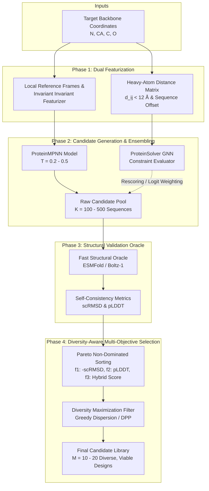

# PROPOSED SYSTEM ARCHITECTURE (PROVISIONAL)

> [!NOTE]
> This architecture is **provisional** and subject to empirical falsification during Phase 1 (Experiments E0–E5). It serves as the formal specification for our experimental implementation.

---

## 1. System Pipeline Architecture

---

## 2. Component Specifications

### Component A: Dual-Stream Featurization
1. **ProteinMPNN Featurizer:** Converts 3D coordinates into k-NN graphs ($k=48$) with local rotation matrices $\mathbf{R}_i$, unit translation vectors, and backbone dihedral angles.
2. **ProteinSolver Featurizer:** Computes pairwise Euclidean distances between heavy atoms, thresholds at $12.0\text{ \AA}$, and extracts sequence separation $|i - j|$.

### Component B: Candidate Sampling & Model Fusion
- **Mechanism 1 (Post-Hoc Rescoring):**
  Generate $K$ sequences from ProteinMPNN at temperature $T \in [0.2, 0.5]$ to maintain high backbone compliance while encouraging sequence diversity.
  Evaluate each sequence $s^{(k)}$ through ProteinSolver to obtain CSP constraint satisfaction score:
  $$S_{\text{PS}}(s^{(k)}) = \frac{1}{N} \sum_{i=1}^N \log P_{\text{PS}}(s_i^{(k)} \mid D)$$
- **Mechanism 2 (Inference-Time Logit Mixture):**
  At each decoding step $t$:
  $$z_{\text{hybrid}}(a) = \lambda \cdot z_{\text{MPNN}}(a \mid s_{<t}, \mathbf{X}) + (1 - \lambda) \cdot z_{\text{PS}}(a \mid s_{<t}, D)$$
  where $\lambda \in [0.7, 0.95]$ biases toward ProteinMPNN while injecting ProteinSolver's distance-constraint preferences.

### Component C: Structural Validation Filter
- Each generated sequence $s^{(k)}$ is folded in a single forward pass using **ESMFold** to produce predicted 3D coordinates $\hat{\mathbf{X}}^{(k)}$.
- Compute:
  1. $\text{scRMSD}(k) = \text{RMSD}(\hat{\mathbf{X}}^{(k)}_{\text{CA}}, \mathbf{X}^{\text{target}}_{\text{CA}})$
  2. $\text{pLDDT}(k) = \frac{1}{N} \sum_{i=1}^N \text{pLDDT}_i$
- Candidates with $\text{scRMSD} > 2.0\text{ \AA}$ or $\text{pLDDT} < 80$ are marked as non-viable.

### Component D: Diversity-Aware Pareto Selection
From the filtered set of viable candidates $\mathcal{V}$, select a final library $S^* \subset \mathcal{V}$ of size $M$ ($M \ll K$) that optimizes:
$$\max_{S^* \subset \mathcal{V}, |S^*|=M} \left[ \sum_{u \in S^*} \text{Fitness}(u) + \beta \sum_{u, v \in S^*, u \ne v} \text{Distance}(u, v) \right]$$
where:
- $\text{Fitness}(u) = w_1 (2.0 - \text{scRMSD}(u)) + w_2 (\text{pLDDT}(u) / 100) + w_3 S_{\text{PS}}(u)$
- $\text{Distance}(u, v) = 1 - \frac{\text{SequenceIdentity}(u, v)}{L}$
- Solved via greedy $k$-center or submodular facility dispersion.

---

## 3. Failure Detection & Fallback Modes
1. **If ProteinSolver scores do not correlate with structural viability:**
   - Deactivate Component B's logit mixing ($\lambda = 1.0$).
   - Transition to evaluating whether ProteinSolver can identify specific local packing errors or whether it should be replaced by a modern sequence language model (ESM-2).
2. **If ESMFold is too memory-intensive for local execution:**
   - Fall back to lightweight proxy metrics (Rosetta score / secondary structure agreement) for initial screening, and run ESMFold/ColabFold in small batches.
