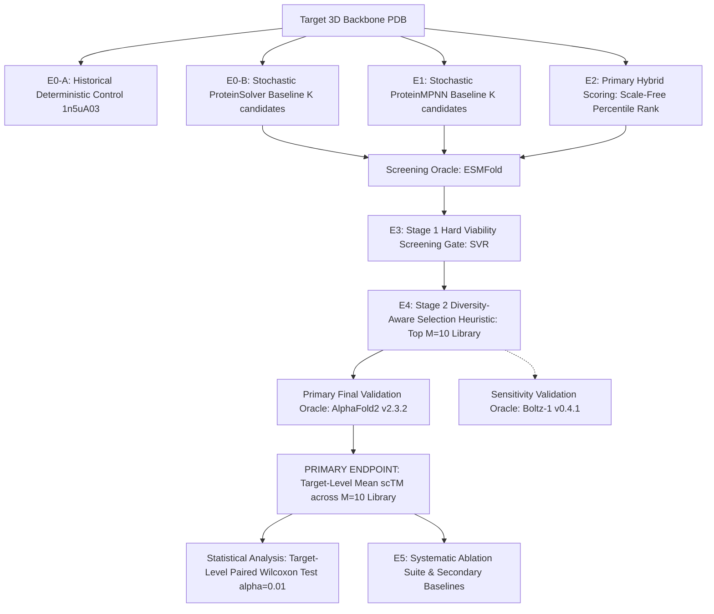

# EVALUATION PROTOCOL & EXPERIMENTAL SPECIFICATION (E0–E5)

This protocol specifies the controlled experimental matrix designed to empirically validate or falsify the project's primary research hypothesis:
> *"Does ProteinSolver's distance-graph constraint-satisfaction scoring provide orthogonal structural signal that improves modern inverse-folding candidate selection, or does modern inverse folding combined with structural validation dominate hybrid selection?"*

---

## 1. Experimental Matrix Overview

---

## 2. Experiment Specifications

### Experiment E0: ProteinSolver Baselines (Separated E0-A vs. E0-B)

#### E0-A: Historical Deterministic Integration Control
- **Purpose:** Regression safeguard verifying that the cleanroom environment and compatibility layer reproduce the historical deterministic MAP CSP execution.
- **Target:** Single historical structure 1n5uA03 (CATH domain, length 92 residues).
- **Execution Mode:** Deterministic MAP (`data.x = 20`, `data.y = None`, CPU execution).
- **Verified Result:** 41.30% native sequence recovery (38/92 matches) in 1.73s.
- **Reporting Rule:** E0-A is classified strictly as a **single-target integration control**. It is NOT a stochastic sampling experiment, NOT a multi-target benchmark, and NOT proof of generalizability.

#### E0-B: Stochastic ProteinSolver Baseline
- **Purpose:** Generate a candidate pool from standalone ProteinSolver under stochastic sampling for fair benchmark comparison against modern models.
- **Inputs:** Target backbone heavy-atom distance matrix ($d_{ij} < 12\text{ \AA}$) and sequence separation $|i - j|$.
- **Sampling:** Stochastic CSP masked residue sampling across temperature grid $T \in \{0.1, 0.5, 1.0\}$.
- **Candidate Budget:** Exactly matched candidate generation budget $K = 100$ (tuning) or $K = 500$ (primary test) per target.
- **Metrics Computed:** Macro-average AAR, ProteinSolver Masked Pseudo-Perplexity (diagnostic), scRMSD (C$\alpha$ Kabsch), scTM (fixed-correspondence), pLDDT (ESMFold screening oracle), Generative Structural Viability Rate (SVR), Order-independent pairwise Hamming diversity.

---

### Experiment E1: Modern Inverse-Folding Baselines
- **Goal:** Establish reference modern inverse-folding baselines using official ProteinMPNN (Dauparas et al. 2022).
- **Inputs:** Full backbone atomic coordinates (N, CA, C, O).
- **Sampling:** Autoregressive sampling across temperature grid $T \in \{0.1, 0.2, 0.5, 0.8, 1.0\}$ with random residue decoding permutation orders.
- **Candidate Budget:** Exactly matched candidate generation budget $K = 100$ (tuning) or $K = 500$ (primary test) per target.
- **Metrics Computed:** Same as E0-B. ProteinMPNN Autoregressive Perplexity is computed as a within-model diagnostic; it is NOT cross-model comparable to ProteinSolver masked pseudo-perplexity.

---

### Experiment E2: Primary Hybrid Scoring & Candidate Fusion

#### 1. Primary Hybrid Formulation (Scale-Free Within-Pool Percentile Normalization)
Because ProteinMPNN sequence-level scores (autoregressive log-probabilities) and ProteinSolver sequence-level scores (single-site masked pseudo-log-likelihoods, PLL) originate from different mathematical objectives and numerical scales, raw addition is methodologically invalid.
The **PRIMARY HYBRID METHOD** normalizes scores to scale-free within-pool percentiles:
1. For each candidate $u$ in the target's candidate pool of size $K$:
   $$p_{\text{MPNN}}(u) = \frac{\text{rank}(S_{\text{MPNN}}(u))}{K} \in (0, 1]$$
   $$p_{\text{PS}}(u) = \frac{\text{rank}(S_{\text{PS}}(u))}{K} \in (0, 1]$$
   where $S_{\text{MPNN}}(u)$ is mean autoregressive log-probability, $S_{\text{PS}}(u)$ is mean masked pseudo-log-likelihood (PLL), and ties are resolved deterministically using average ranking. Higher percentile indicates higher model confidence.
2. The primary hybrid score is:
   $$H(u) = \lambda \cdot p_{\text{MPNN}}(u) + (1 - \lambda) \cdot p_{\text{PS}}(u), \quad \lambda \in [0.0, 1.0]$$
3. **Hyperparameter Freezing Rule:**
   The mixing coefficient $\lambda$ is tuned **strictly on the development/tuning set** (CATH 4.2 validation split, 20 backbones) across a pre-registered grid $\lambda \in \{0.0, 0.2, 0.4, 0.5, 0.6, 0.8, 1.0\}$ and frozen prior to primary test evaluation.

#### 2. Exploratory Ablations
- **Ablation 2.1 (Raw Logit Interpolation):** $z_{\text{hybrid}} = \lambda z_{\text{MPNN}} + (1 - \lambda) z_{\text{PS}}$ is evaluated strictly as an exploratory ablation.
- **Ablation 2.2 (Sequential Rescoring):** Generate $K$ candidates with ProteinMPNN ($T=0.5$), then rescore and rank via ProteinSolver pseudo-log-likelihood.
- **Ablation 2.3 (Dual-Conditioned Masking):** Use ProteinSolver to identify high-confidence structural anchor positions, freeze them, and design remaining positions with ProteinMPNN.

---

### Experiment E3: Structural Screening & Viability Filtering (Stage 1)
- **Goal:** Filter raw generated candidates through an initial high-throughput screening oracle (ESMFold) to eliminate folding failures.
- **Protocol:**
  - Fold all raw candidates ($K$ per target per method) using ESMFold locally.
  - Compute fixed-correspondence scRMSD against target backbone and mean pLDDT.
  - Apply project screening threshold: Viable candidates satisfy $\text{scRMSD}_{\text{screen}} \le 2.0\text{ \AA}$ and $\text{pLDDT}_{\text{screen}} \ge 80.0$.
  - Compute Generative Structural Viability Rate (SVR):
    $$\text{SVR} = \frac{|\{s \in S_{\text{raw}} \mid \text{scRMSD}_{\text{screen}}(s) \le 2.0\text{ \AA} \land \text{pLDDT}_{\text{screen}}(s) \ge 80.0\}|}{|S_{\text{raw}}|}$$
  - Compute Viable Candidate Sequence Diversity ($\text{Div}_{\text{viable}}$).
  - Surviving candidates form the selection pool $S_{\text{viable}}$.

---

### Experiment E4: Diversity-Aware Candidate Selection (Stage 2) & Final Validation

#### 1. Stage 2 Selection Protocol (Greedy Diversity-Aware Selection Heuristic)
From viable candidates $S_{\text{viable}}$, select exactly $M = 10$ candidates using greedy facility dispersion:
$$u^* = \arg\max_{u \in S_{\text{viable}} \setminus S'} \left[ \text{score}(u) + \gamma \cdot \min_{v \in S'} d(u, v) \right]$$
where $d(u, v)$ is normalized Hamming distance, and $\text{score}(u)$ is the candidate quality score ($H(u)$ for hybrid, $S_{\text{MPNN}}(u)$ for MPNN-only).
*Methodological Rule:* This greedy score is a **construction heuristic** and is NEVER reported as an intrinsic static candidate quality metric.

#### 2. Primary Final Structural Validation Oracle (FROZEN)
To prevent circular evaluation leakage, the final selected library $S_{\text{selected}}$ ($M = 10$ per target) is folded and evaluated using the **Primary Final Structural Validation Oracle**:
- **Oracle:** **AlphaFold2 (v2.3.2)**
- **Model Checkpoint:** Monomodel weights `model_1_ptm`
- **Inference Configuration:** Single sequence mode (no MSA search, no homologous templates), 3 recycles, standard Amber relaxation disabled for throughput consistency, precision FP16/BF16 on GPU.
- **Sensitivity Validation Oracle:** **Boltz-1 (v0.4.1)** is designated as a secondary sensitivity analysis oracle.

#### 3. Primary Endpoint Evaluation
On the AlphaFold2 validated structures of the selected library $S_{\text{selected}}$, compute:
- **PRIMARY STUDY ENDPOINT:** Target-level mean fixed-correspondence scTM:
  $$\overline{\text{scTM}}_{\text{val}}(t) = \frac{1}{M} \sum_{m=1}^M \text{scTM}_{\text{val}}(s^{(m)}_t)$$
- Independent Validation Yield (IVY):
  $$\text{IVY} = \frac{|\{s \in S_{\text{selected}} \mid \text{scRMSD}_{\text{val}}(s) \le 2.0\text{ \AA} \land \text{pLDDT}_{\text{val}}(s) \ge 80.0\}|}{|S_{\text{selected}}|}$$
- Selected Library Diversity ($\text{Div}_{\text{selected}}$): Order-independent pairwise Hamming diversity.

---

### Experiment E5: Systematic Ablation Suite & Secondary Baselines
- **Goal:** Falsify alternative explanations and evaluate secondary model architectures.
- **Mandatory Reporting Rule:**
  *Secondary baselines (e.g. PiFold, ESM-IF1) and exploratory analyses are reported regardless of outcome. No baseline or model variant may be omitted based on negative or unfavorable results.*
- **Ablation Matrix:**
  1. **Ablation 5.1 (No ProteinSolver):** Does ProteinMPNN alone + temperature sweep + diversity selection achieve identical or superior target-level scTM compared to the hybrid?
  2. **Ablation 5.2 (Naive Clustering vs. Selection Heuristic):** Does simple CD-HIT clustering at 30% sequence identity match the two-stage selection framework?
  3. **Ablation 5.3 (Oracle Sensitivity):** Does evaluating the selected library with Boltz-1 alter the direction or statistical significance of the primary endpoint comparison?
  4. **Ablation 5.4 (Secondary Baselines):** Evaluate PiFold (Gao et al. 2023) and ESM-IF1 (Hsu et al. 2022) under identical budget and evaluation protocols.

---

## 3. Statistical Analysis Protocol

### 1. Statistical Unit of Analysis
The experimental unit of analysis is the **TARGET / BACKBONE** ($N = 50$ targets in the primary test set).
Individual generated candidates ($K = 100$ or $500$) and selected candidates ($M = 10$) are nested within targets and are not independent replicates.

### 2. Primary Hypothesis Test
- **Comparison:** Target-level paired difference between primary hybrid selection and ProteinMPNN-only selection:
  $$d_t = \overline{\text{scTM}}_{\text{hybrid}}(t) - \overline{\text{scTM}}_{\text{MPNN-only}}(t) \quad \text{for } t = 1, \dots, N$$
- **Primary Test:** Two-sided paired Wilcoxon signed-rank test on $\{d_t\}_{t=1}^N$.
- **Significance Level:** Pre-registered threshold $\alpha = 0.01$.
- **Effect Size:** Hodges-Lehmann median paired difference and paired Cohen's $d_z$.
- **Confidence Intervals:** 95% and 99% bootstrap confidence intervals computed over 10,000 resamples.
- **Missing / Failed Targets:** If oracle folding fails on a target, it is recorded as a failure and assigned $\text{scTM} = 0.0$.
- **Stratification:** Primary analysis is performed on the TS50 natural test set ($N=50$). The RFdiffusion de novo test set ($N=15$) is analyzed and reported separately.

---

## 4. Benchmark Dataset Allocation & Candidate Budgets

### 1. Candidate Budget Accounting
- **Definition of $K$:** Total candidate generation budget **PER TARGET PER METHOD PER CONDITION**.
- **Stage Progression:**
  1. **Generation Budget ($K$):** $K = 100$ per target for development/tuning; $K = 500$ per target for frozen primary test evaluation.
  2. **Screening Pool ($S_{\text{raw}}$):** All $K$ candidates evaluated by screening oracle (ESMFold).
  3. **Selection Pool ($S_{\text{viable}}$):** Subset surviving hard viability gate ($\text{scRMSD}_{\text{screen}} \le 2.0\text{ \AA} \land \text{pLDDT}_{\text{screen}} \ge 80.0$).
  4. **Selected Library ($S_{\text{selected}}$):** Exactly $M = 10$ candidates chosen by diversity-aware selection heuristic.
  5. **Final Validation Pool:** Exactly the $M = 10$ candidates evaluated by primary validation oracle (AlphaFold2).

### 2. Dataset Partitions & Training Provenance

| Benchmark Subset | Purpose | Target Count ($N$) | Selection & Provenance Criteria |
|---|---|---|---|
| **Development / Tuning Set** | Hyperparameter search ($\lambda, T, \gamma$) | 20 backbones | CATH 4.2 validation split; diverse topologies. |
| **Primary Test Set** | Frozen primary hypothesis testing | 50 backbones | TS50 non-redundant PDB crystal structures ($<30\%$ sequence identity to training sets). Training membership: documented per model. |
| **De Novo Test Set** | Generalizability on non-natural scaffolds | 15 backbones | RFdiffusion generated scaffolds (Watson et al. 2023). Described neutrally as "RFdiffusion-generated de novo backbones" (NOT called "homology-free" without explicit sequence/structural search). |

---

## 5. Hardware & Runtime Budget

- **Local Machine Constraints:** Single GPU (NVIDIA RTX 3050 6GB Laptop GPU) / CPU execution.
- **Folding Oracle Strategy:** ESMFold locally for high-throughput screening ($K = 100–500$); AlphaFold2 (v2.3.2) for primary final validation of selected libraries ($M = 10$); Boltz-1 (v0.4.1) for sensitivity analysis.
- **Latency Protocol:** All models benchmarked on identical hardware, recording device, precision, batch size, warm-up iterations (5 sequences), and excluding model loading/data extraction overhead.

