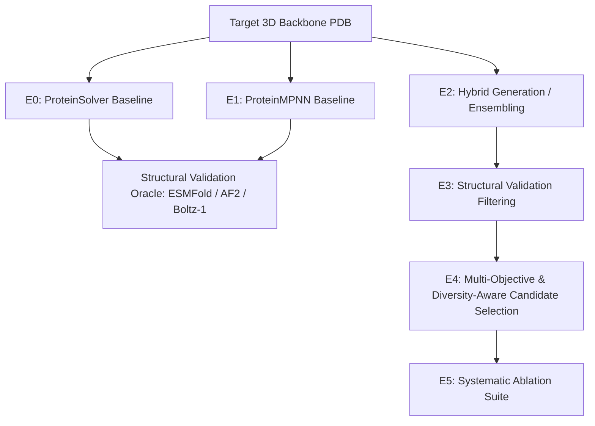

# EVALUATION PROTOCOL & EXPERIMENTAL SPECIFICATION (E0–E5)

This protocol specifies the controlled experimental matrix designed to empirically validate or falsify the project's primary hypothesis.

---

## 1. Experimental Matrix Overview

---

## 2. Experiment Specifications

### Experiment E0: Standalone ProteinSolver Baseline
- **Goal:** Establish reference performance of the original 4-block residual GNN using canonical weights from `ostrokach/proteinsolver`.
- **Inputs:** Target backbone distance matrix ($d_{ij} < 12\text{ \AA}$) and sequence separation $|i - j|$.
- **Sampling:** CSP-based sequential masked residue prediction at default temperature $T \in \{0.1, 0.5, 1.0\}$.
- **Outputs:** Candidate sequences $S_{\text{E0}}$ ($K = 100$ per target).
- **Metrics Computed:** AAR, Perplexity, scRMSD, scTM, pLDDT, Diversity, Candidate Survival Rate (CSR).

### Experiment E1: Modern Inverse-Folding Baselines
- **Goal:** Establish state-of-the-art benchmarks using ProteinMPNN (and optionally PiFold / ESM-IF1).
- **Inputs:** Full backbone atomic coordinates (N, CA, C, O).
- **Sampling:** Autoregressive sampling across temperature grid $T \in \{0.1, 0.2, 0.5, 0.8, 1.0\}$ with random decoding orders.
- **Outputs:** Candidate sequences $S_{\text{E1}}$ ($K = 100$ per target).
- **Metrics Computed:** Same as E0.

### Experiment E2: ProteinSolver + Modern Model Fusion (Hybrid Scoring)
- **Goal:** Test whether combining ProteinSolver and ProteinMPNN provides complementary signal.
- **Formulations Tested:**
  1. **Logit Interpolation:**
     $$z_{\text{hybrid}}(a_i) = \lambda \cdot z_{\text{MPNN}}(a_i) + (1 - \lambda) \cdot z_{\text{PS}}(a_i), \quad \lambda \in \{0.0, 0.2, 0.5, 0.8, 0.9, 1.0\}$$
  2. **Sequential Rescoring:** Generate candidates with ProteinMPNN ($T=0.5$), then rescore and rank via ProteinSolver log-likelihood.
  3. **Dual-Conditioned Masking:** Use ProteinSolver to identify high-confidence structural anchor positions, freeze them, and design remaining positions with ProteinMPNN.
- **Primary Milestone:** Determine if any hybrid configuration achieves higher recovery or lower scRMSD than pure ProteinMPNN ($\lambda = 1.0$).

### Experiment E3: Structural Validation Pipeline Integration
- **Goal:** Filter raw generated candidates through independent 3D folding oracles (ESMFold, AlphaFold2, or Boltz-1).
- **Protocol:**
  - Fold all candidates from E0, E1, and E2 using ESMFold.
  - Compute scRMSD against target backbone and mean pLDDT.
  - Apply canonical threshold: Viable candidates satisfy $\text{scRMSD} \le 2.0\text{ \AA}$ and $\text{pLDDT} \ge 80.0$.
  - Compute Candidate Survival Rate (CSR).

### Experiment E4: Diversity-Aware Multi-Objective Candidate Selection
- **Goal:** Select the optimal top-$M$ ($M = 10$ or $20$) candidate library from a large pool ($K = 500$) maximizing both quality and mutual diversity.
- **Selection Formulation:**
  - Multi-objective Pareto ranking across:
    1. Inverse-folding likelihood / confidence ($S_{\text{MPNN}}$ and/or $S_{\text{PS}}$)
    2. Structural self-consistency ($-\text{scRMSD}$)
    3. Structural confidence ($\text{pLDDT}$)
    4. Maximum-dispersion sequence diversity:
       $$\max_{S' \subset S, |S'|=M} \sum_{u, v \in S'} \text{dist}(u, v) + \gamma \sum_{u \in S'} \text{Quality}(u)$$
  - Implemented via greedy facility dispersion or Determinantal Point Processes (DPP).
- **Metrics Computed:** Pareto Hypervolume (HV), Library Mean Diversity, Library Survival Rate.

### Experiment E5: Systematic Ablation Study
- **Goal:** Falsify alternative explanations and identify essential components.
- **Ablation Questions:**
  1. **Ablation 5.1 (No ProteinSolver):** Does ProteinMPNN alone + temperature sweep + diversity selection achieve identical Pareto hypervolume? If YES, ProteinSolver is redundant.
  2. **Ablation 5.2 (Naive Clustering vs. Pareto Selection):** Does simple CD-HIT clustering at 30% sequence identity match the Pareto selection framework?
  3. **Ablation 5.3 (Oracle Sensitivity):** Does replacing ESMFold with AlphaFold2 or Boltz-1 alter the ranking of candidates?

---

## 3. Benchmark Dataset Allocation

| Benchmark Subset | Purpose | Number of Targets | Selection Criteria |
|---|---|---|---|
| **Development / Tuning Set** | Hyperparameter search ($\lambda, T, \gamma$) | 20 backbones | CATH 4.2 validation split; diverse folds ($\alpha, \beta, \alpha/\beta$). |
| **Primary Test Set** | Frozen evaluation of E0–E5 | 50 backbones | TS50 / CATH 4.2 test split with $<30\%$ identity to all training sets. |
| **De Novo Test Set** | Test on hallucinated backbones without natural homologs | 15 backbones | RFdiffusion generated scaffolds (Watson et al. 2023). |

---

## 4. Hardware & Runtime Budget

- **Local Machine Constraints:** Single GPU / CPU execution.
- **Candidate Pool Size:** $K = 100$ sequences per target for fast evaluation; $K = 500$ for final test benchmark.
- **Folding Oracle:** Use ESMFold locally (fast single-pass transformer) for primary screening; validate top candidates with AlphaFold2 / ColabFold / Boltz-1.
