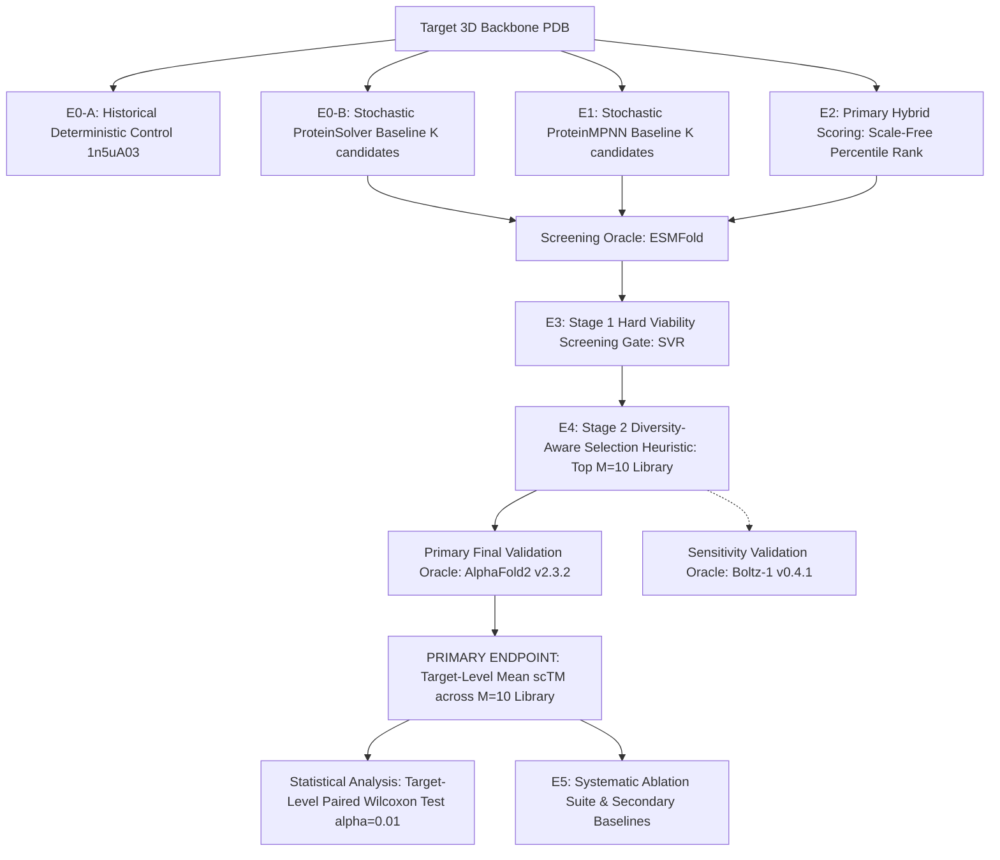

# EVALUATION PROTOCOL & EXPERIMENTAL SPECIFICATION (E0–E5)

This protocol specifies the controlled experimental matrix designed to empirically validate or falsify the project's primary research hypothesis:
> *"Does ProteinSolver's distance-graph constraint-satisfaction scoring provide orthogonal structural signal that improves modern inverse-folding candidate selection, or does modern inverse folding combined with structural validation dominate hybrid selection?"*

---

## 1. Experimental Matrix Overview

---

## 2. Experiment Specifications

### Experiment E0: ProteinSolver Baselines (Separated E0-A vs. E0-B)

#### E0-A: Historical Deterministic Integration Control
- **Purpose:** Regression safeguard verifying that the cleanroom environment and compatibility layer reproduce the historical deterministic MAP CSP execution.
- **Target:** Single historical structure 1n5uA03 (CATH domain, length 92 residues).
- **Execution Mode:** Deterministic MAP (`data.x = 20`, `data.y = None`, CPU execution).
- **Verified Result:** 41.30% native sequence recovery (38/92 matches) in 1.73s.
- **Reporting Rule:** E0-A is classified strictly as a **single-target integration control**. It is NOT a stochastic sampling experiment, NOT a multi-target benchmark, and NOT proof of generalizability.

#### E0-B: Stochastic ProteinSolver Baseline
- **Purpose:** Generate a candidate pool from standalone ProteinSolver under stochastic sampling for fair benchmark comparison against modern models.
- **Inputs:** Target backbone heavy-atom distance matrix ($d_{ij} < 12\text{ \AA}$) and sequence separation $|i - j|$.
- **Sampling:** Stochastic CSP masked residue sampling across temperature grid $T \in \{0.1, 0.5, 1.0\}$.
- **Candidate Budget:** Exactly matched candidate generation budget $K = 100$ (tuning) or $K = 500$ (primary test) per target.
- **Metrics Computed:** Macro-average AAR, ProteinSolver Masked Pseudo-Perplexity (diagnostic), scRMSD (C$\alpha$ Kabsch), scTM (fixed-correspondence), pLDDT (ESMFold screening oracle), Generative Structural Viability Rate (SVR), Order-independent pairwise Hamming diversity.

---

### Experiment E1: Modern Inverse-Folding Baselines
- **Goal:** Establish reference modern inverse-folding baselines using official ProteinMPNN (Dauparas et al. 2022).
- **Inputs:** Full backbone atomic coordinates (N, CA, C, O).
- **Sampling:** Autoregressive sampling across temperature grid $T \in \{0.1, 0.2, 0.5, 0.8, 1.0\}$ with random residue decoding permutation orders.
- **Candidate Budget:** Exactly matched candidate generation budget $K = 100$ (tuning) or $K = 500$ (primary test) per target.
- **Metrics Computed:** Same as E0-B. ProteinMPNN Autoregressive Perplexity is computed as a within-model diagnostic; it is NOT cross-model comparable to ProteinSolver masked pseudo-perplexity.

---

### Experiment E2: Primary Hybrid Scoring & Candidate Fusion

#### 1. Primary Hybrid Formulation (Scale-Free Within-Pool Percentile Normalization)
Because ProteinMPNN sequence-level scores (autoregressive log-probabilities) and ProteinSolver sequence-level scores (single-site masked pseudo-log-likelihoods, PLL) originate from different mathematical objectives and numerical scales, raw addition is methodologically invalid.
The **PRIMARY HYBRID METHOD** normalizes scores to scale-free within-pool percentiles:
1. For each candidate $u$ in the target's candidate pool of size $K$:
   $$p_{\text{MPNN}}(u) = \frac{\text{rank}(S_{\text{MPNN}}(u))}{K} \in (0, 1]$$
   $$p_{\text{PS}}(u) = \frac{\text{rank}(S_{\text{PS}}(u))}{K} \in (0, 1]$$
   where $S_{\text{MPNN}}(u)$ is mean autoregressive log-probability, $S_{\text{PS}}(u)$ is mean masked pseudo-log-likelihood (PLL), and ties are resolved deterministically using average ranking. Higher percentile indicates higher model confidence.
2. The primary hybrid score is:
   $$H(u) = \lambda \cdot p_{\text{MPNN}}(u) + (1 - \lambda) \cdot p_{\text{PS}}(u), \quad \lambda \in [0.0, 1.0]$$
3. **Development Hyperparameter Selection & Freezing Protocol ($T^*, \lambda^*, \gamma^*$):**
   - **Development Set Manifest:** Frozen in immutable manifest `data/manifests/development_20_cath42.txt` (canonical LF SHA-256: `47ab5fec66017b455f7eabee143dc83e99ec740640e945ed96752abb59483069`), comprising 20 backbones from the Ingraham/Dauparas CATH 4.2 validation split (`chain_set_splits.json`, raw downloaded artifact SHA-256: `8e9a587a50c7f6c026e4ed00f6c1c30b106100f36f7a01de47542bdfc060adc2`) spanning 20 distinct CATH topologies. Target `4bdx.A` duplicates topology `2.10.25` of `1f7e.A` and is correctly bypassed, selecting `3hxi.A` as target 20.
   - **Optimization Objective ($J$):** All development parameters are selected by maximizing the target-level mean fixed-correspondence scTM across the $N_{\text{dev}} = 20$ CATH 4.2 validation backbones of the final selected $M=10$ library:
     $$J = \frac{1}{N_{\text{dev}}} \sum_{t=1}^{N_{\text{dev}}} \overline{\text{scTM}}_{\text{val}}(t) = \frac{1}{N_{\text{dev}}} \sum_{t=1}^{N_{\text{dev}}} \left( \frac{1}{M} \sum_{m=1}^M \text{scTM}_{\text{val}}(s_{t,m}) \right)$$
     evaluated using the frozen Primary Final Structural Validation Oracle (AlphaFold2 v2.3.2, monomodel weights `model_1_ptm`, single-sequence mode, no templates, 3 recycles, `float16`/`fp16` on GPU, fixed inference seed = 42, Amber disabled).
   - **Development Infeasibility Rule ($J = -\infty$):**
     Every candidate hyperparameter configuration must produce an $M=10$ unique viable library on ALL 20 development targets to be eligible for the primary $J$ argmax.
     If ANY single target is `SELECTION_INFEASIBLE_LT_M` ($<10$ unique viable candidates) for that configuration:
     - The configuration is INELIGIBLE and receives objective $J = -\infty$ for argmax purposes.
     - No zero-filling (0.0), target exclusion, $M$ reduction, regeneration beyond $K=100$, or threshold alteration is permitted.
     - Configuration infeasibility rate is reported separately: $\text{infeasibility\_rate} = N_{\text{infeasible}} / N_{\text{dev}}$.
     - If all configurations in a tuning arm are infeasible, STOP THAT TUNING ARM and classify the stage as `DEVELOPMENT_TUNING_STAGE_INFEASIBLE` rather than inventing a fallback.
   - **MPNN-Only Parameter Selection:** Complete Cartesian product $T_{\text{MPNN}} \times \gamma$ ($T_{\text{MPNN}} \in \{0.1, 0.2, 0.5, 0.8, 1.0\}$, $\gamma \in \{0.0, 0.25, 0.5, 1.0, 2.0\}$, 25 combinations). For every combination: candidate generation $\to$ ESMFold screening $\to$ deduplication $\to$ $M=10$ greedy selection $\to$ AlphaFold2 validation $\to$ objective $J$. Select $(T^*_{\text{MPNN}}, \gamma^*_{\text{MPNN}}) = \arg\max J$.
   - **ProteinSolver E0-B Parameter Selection:** Complete Cartesian product $T_{\text{PS}} \times \gamma$ ($T_{\text{PS}} \in \{0.1, 0.5, 1.0\}$, $\gamma \in \{0.0, 0.25, 0.5, 1.0, 2.0\}$, 15 combinations). Select $(T^*_{\text{PS}}, \gamma^*_{\text{PS}}) = \arg\max J$.
   - **Primary Hybrid Parameter Selection:** The hybrid MUST evaluate the Common Candidate Universe generated by ProteinMPNN at $T^*_{\text{MPNN}}$. Therefore, $T^*_{\text{hybrid}} = T^*_{\text{MPNN}}$ (zero independent temperature sweep). Complete Cartesian product $\lambda \times \gamma$ ($\lambda \in \{0.0, 0.2, 0.4, 0.5, 0.6, 0.8, 1.0\}$, $\gamma \in \{0.0, 0.25, 0.5, 1.0, 2.0\}$, 35 combinations). Score $U_t$ with both models $\to$ percentile normalize $\to$ compute $H(u)$ $\to$ ESMFold screening $\to$ unique viable deduplication $\to$ $M=10$ greedy selection $\to$ AlphaFold2 validation $\to$ objective $J$. Select $(\lambda^*, \gamma^*_{\text{hybrid}}) = \arg\max J$.
   - **Development Generation Reuse & Efficiency (Caching):**
     Candidate pools at each temperature $T$ are generated once, screened once with ESMFold, and scored once, then reused across all diversity weights $\gamma$ (and across all $35$ $(\lambda, \gamma)$ combinations for hybrid on $U_t$). Caching is strictly semantics-preserving and must not alter candidate identities, order, RNG streams, scores, screening outcomes, or selection behavior.
   - **Deterministic Freezing Order:**
     1. Select $(T^*_{\text{MPNN}}, \gamma^*_{\text{MPNN}})$.
     2. Select $(T^*_{\text{PS}}, \gamma^*_{\text{PS}})$.
     3. Using $T^*_{\text{MPNN}}$, select $(\lambda^*, \gamma^*_{\text{hybrid}})$.
     4. Freeze ALL resulting parameters.
     5. Only then permit TS50 execution. Zero test-set inspection or tuning permitted.
   - **Deterministic Tie-Breaking:** If two combinations achieve identical $J$, resolve via ascending lexicographical grid order (for $(T, \gamma)$: ascending $T$, then ascending $\gamma$; for $(\lambda, \gamma)$: ascending $\lambda$, then ascending $\gamma$). No secondary optimization criteria permitted.

#### 2. Exploratory Ablations
- **Ablation 2.1 (Raw Logit Interpolation):** $z_{\text{hybrid}} = \lambda z_{\text{MPNN}} + (1 - \lambda) z_{\text{PS}}$ is evaluated strictly as an exploratory ablation.
- **Ablation 2.2 (Sequential Rescoring):** Generate $K$ candidates with ProteinMPNN ($T=0.5$), then rescore and rank via ProteinSolver pseudo-log-likelihood.
- **Ablation 2.3 (Dual-Conditioned Masking):** Use ProteinSolver to identify high-confidence structural anchor positions, freeze them, and design remaining positions with ProteinMPNN.

---

### Experiment E3: Structural Screening & Viability Filtering (Stage 1)
- **Goal:** Filter raw generated candidates through an initial high-throughput screening oracle (ESMFold) to eliminate folding failures.
- **Screening Oracle Configuration (ESMFold):**
  - **Applicability Scope:** Frozen ESMFold execution path applies to all registered benchmark pipeline stages that use ESMFold, including E1 development tuning and TS50 primary evaluation.
  - **Implementation:** Meta AI `esm` (v2.0.0) / Hugging Face `transformers` `facebook/esmfold_v1`.
  - **Checkpoint:** `esmfold_v1` (3B parameters).
  - **Mode:** Sequence-only input mode (zero MSA search, zero homologous templates).
  - **Recycles:** Exactly 4 recycles (`num_recycles = 4`).
  - **Device & Precision (Frozen Benchmark Path):** Strictly GPU CUDA, `float16` (`fp16`). If CUDA is unavailable or GPU OOM occurs, classify as `INFRASTRUCTURE_FAILURE` (retried exactly once using the identical frozen configuration, then logged as unvalidated if unresolvable); CPU `float32` execution is strictly non-confirmatory diagnostic mode.
  - **Length & Chunking (Frozen Benchmark Path):** Maximum sequence length $L \le 1024$ (targets with $L > 1024$ rejected at preflight); attention chunking frozen to `chunk_size = 128` (memory exhaustion treated as infrastructure failure; chunk size 64 classified as diagnostic).
  - **Fixed Screening Seed:** Fixed integer seed = 42 (`seed = 42`).
  - **Output & Metrics:** Predicted 3D atomic coordinates; 1-to-1 $C_\alpha$ correspondence to native backbone; Kabsch-aligned scRMSD; sequence-mean pLDDT $\in [0, 100]$.

- **Operational Screening Thresholds:**
  - Viable candidates satisfy:
    $$\text{scRMSD}_{\text{screen}} \le 2.0\text{ \AA} \quad \text{AND} \quad \text{pLDDT}_{\text{screen}} \ge 80.0$$
  - Threshold Provenance: Explicitly designated as project-chosen operational screening thresholds informed by literature standards (Lin et al. 2023, Watson et al. 2023); NOT universal physical constants.
- **Metrics Computed:**
  - Generative Structural Viability Rate (SVR):
    $$\text{SVR} = \frac{|\{s \in S_{\text{raw}} \mid \text{scRMSD}_{\text{screen}}(s) \le 2.0\text{ \AA} \land \text{pLDDT}_{\text{screen}}(s) \ge 80.0\}|}{|S_{\text{raw}}|}$$
  - Viable Candidate Sequence Diversity ($\text{Div}_{\text{viable}}$).
  - Surviving candidates form the selection pool $S_{\text{viable}}$.

---

### Experiment E4: Diversity-Aware Candidate Selection (Stage 2) & Final Validation

#### 1. Stage 2 Selection Protocol (Greedy Diversity-Aware Selection Heuristic)
From viable candidates $S_{\text{viable}}$, the pipeline filters duplicate sequences to form $S_{\text{viable, unique}}$, retaining the highest-scoring candidate for identical sequences (with duplicate rate reported separately).
- **Insufficient Viable Candidates Rule:** If $|S_{\text{viable, unique}}| < M=10$, the target arm is marked **`SELECTION_INFEASIBLE_LT_M`**. No silent regeneration, padding, or post hoc threshold changes occur. Primary endpoint is undefined for complete-case paired analysis; conservative zero-quality sensitivity analysis is additionally reported.
- **Greedy Facility Dispersion Formula:**
  - First selection ($S' = \emptyset$):
    $$u_1 = \arg\max_{u \in S_{\text{viable, unique}}} \text{score}(u)$$
  - Subsequent selections ($1 \le |S'| < M$):
    $$u^* = \arg\max_{u \in S_{\text{viable, unique}} \setminus S'} \left[ \text{score}(u) + \gamma^* \cdot \min_{v \in S'} d(u, v) \right]$$
  where $d(u, v)$ is normalized Hamming distance in $[0, 1]$.
- **Normalization Consistency of Selection Scores:**
  Both primary arms use scores normalized to the matched $[0, 1]$ percentile rank scale inside the greedy selector:
  - Primary Hybrid Arm: $\text{score}_{\text{hybrid}}(u) = H(u) \in (0, 1]$
  - Primary MPNN-Only Arm: $\text{score}_{\text{MPNN-only}}(u) = p_{\text{MPNN}}(u) \in (0, 1]$
  Underlying raw autoregressive log-likelihood and perplexity remain diagnostic metrics.
- **Diversity Weight ($\gamma$) Search Grid:**
  Pre-registered dimensionless grid $\gamma \in \{0.0, 0.25, 0.5, 1.0, 2.0\}$, tuned strictly on the development set separately for MPNN-only ($\gamma^*_{\text{MPNN}}$) and hybrid selection ($\gamma^*_{\text{hybrid}}$) via the Cartesian grid optimization framework in Section 2, and frozen prior to TS50 evaluation.
- **Deterministic Tie Breaking:**
  All ties in primary score or greedy objective are broken deterministically by stable candidate identifier order (ascending lexicographical ID).
- *Methodological Rule:* This greedy score is a **construction heuristic** and is NEVER reported as an intrinsic static candidate quality metric. Final library diversity is evaluated independently after selection.

#### 2. Primary Final Structural Validation Oracle (AlphaFold2 - FROZEN)
To prevent circular evaluation leakage, the final selected library $S_{\text{selected}}$ ($M = 10$ per target) is folded and evaluated using the **Primary Final Structural Validation Oracle**:
- **Oracle:** **AlphaFold2 (v2.3.2)**
- **Model Checkpoint:** Monomodel weights `model_1_ptm` (384-dim evoformer, fine-tuned with pTM head).
- **Inference Configuration:** Single sequence mode (no MSA search, no homologous templates), 3 recycles, standard Amber relaxation disabled for throughput consistency, precision float16 (`fp16`) on GPU (CUDA), fixed inference seed = 42.
  - Note: Fixed inference seed controls pseudo-random initialization, but does not guarantee bitwise GPU determinism across differing CUDA drivers, cuBLAS algorithms, or hardware platforms.
- **Residue Mapping & Preprocessing Specifications:**
  - Residue Correspondence: 1-to-1 index matching without gap insertion.
  - $C_\alpha$ extraction: Strictly from canonical `ATOM ... CA ...` records.
  - Target cleaning: Native PDB stripped of water, heteroatoms (`HETATM`), and alt-locs (retaining 'A').
  - Length invariant: Candidate length must match native backbone length $L$ exactly.
  - Unresolved residues: All target residues must have 100% resolved $C_\alpha$ coordinates.
  - Chain selection: Target chain explicitly designated (e.g. `chain A`).
  - Output coordinates: Rank-1 unrelaxed $C_\alpha$ coordinates from `model_1_ptm`.
- **Sensitivity Validation Oracle:** **Boltz-1 (v0.4.1)** is designated as a secondary sensitivity analysis oracle.

#### 3. Primary Endpoint Evaluation
On the AlphaFold2 validated structures of the selected library $S_{\text{selected}}$, compute:
- **PRIMARY STUDY ENDPOINT:** Target-level mean fixed-correspondence scTM across the $M=10$ library:
  $$\overline{\text{scTM}}_{\text{val}}(t) = \frac{1}{M} \sum_{m=1}^M \text{scTM}_{\text{val}}(s^{(m)}_t)$$
- Independent Validation Yield (IVY):
  $$\text{IVY} = \frac{|\{s \in S_{\text{selected}} \mid \text{scRMSD}_{\text{val}}(s) \le 2.0\text{ \AA} \land \text{pLDDT}_{\text{val}}(s) \ge 80.0\}|}{|S_{\text{selected}}|}$$
- Selected Library Diversity ($\text{Div}_{\text{selected}}$): Order-independent pairwise Hamming diversity.

---

### Experiment E5: Systematic Ablation Suite & Secondary Baselines
- **Goal:** Falsify alternative explanations and evaluate secondary model architectures.
- **Mandatory Reporting Rule:**
  *Secondary baselines (e.g. PiFold, ESM-IF1) and exploratory analyses are reported regardless of outcome. No baseline or model variant may be omitted based on negative or unfavorable results.*
- **Ablation Matrix:**
  1. **Ablation 5.1 (No ProteinSolver):** Does ProteinMPNN alone + temperature sweep + diversity selection achieve identical or superior target-level scTM compared to the hybrid?
  2. **Ablation 5.2 (Naive Clustering vs. Selection Heuristic):** Does simple CD-HIT clustering at 30% sequence identity match the two-stage selection framework?
  3. **Ablation 5.3 (Oracle Sensitivity):** Does evaluating the selected library with Boltz-1 alter the direction or statistical significance of the primary endpoint comparison?
  4. **Ablation 5.4 (Secondary Baselines):** Evaluate PiFold (Gao et al. 2023) and ESM-IF1 (Hsu et al. 2022) under identical budget and evaluation protocols.

---

## 3. Statistical Analysis Protocol

### 1. Statistical Unit of Analysis
The experimental unit of analysis is the **TARGET / BACKBONE** ($N = 50$ targets in the primary test set).
Individual generated candidates ($K = 100$ or $500$) and selected candidates ($M = 10$) are nested within targets and are not independent replicates.

### 2. Primary Hypothesis Test
- **Comparison:** Target-level paired difference between primary hybrid selection and ProteinMPNN-only selection:
  $$d_t = \overline{\text{scTM}}_{\text{hybrid}}(t) - \overline{\text{scTM}}_{\text{MPNN-only}}(t) \quad \text{for } t = 1, \dots, N$$
- **Primary Test:** Two-sided paired Wilcoxon signed-rank test on $\{d_t\}_{t=1}^N$ (`scipy.stats.wilcoxon(..., zero_method='wilcox', correction=True, alternative='two-sided', method='asymptotic')`). Confirmatory p-value computed using asymptotic normal approximation with continuity correction. Requires finite numeric inputs (NaN/inf rejected; $N \ge 2$ required).
- **Significance Level:** Pre-registered confirmatory threshold $\alpha = 0.01$.
- **Effect Size:** Hodges-Lehmann median paired difference and paired Cohen's $d_z$.
- **Confidence Intervals:** 95% and 99% bootstrap confidence intervals computed over **10,000 resamples of target-level differences $d_t$** ($N=50$, seed 42). Never bootstrap candidates.
- **Three-State Target Outcome Taxonomy:**
  1. *Missing Primary Endpoint (`SELECTION_INFEASIBLE_LT_M`):* Arm produces $< 10$ unique viable candidates. Primary endpoint missing/undefined in complete-case analysis; reported under conservative zero-quality sensitivity.
  2. *Scientific / Model Folding Failure:* Biological failure (non-physical coordinates, steric clash collapse, pLDDT < 10.0); assigned $\text{scTM} = 0.0$, included in $\{d_t\}$.
  3. *Infrastructure / Runtime Failure:* Hardware/system exception (OOM, timeout >600s, software crash); NEVER assigned $\text{scTM} = 0.0$.
     - Retry Policy: Retried exactly once using the identical frozen model, checkpoint, version, precision, device, chunk size, seed, input, timeout, and protocol configuration. Only process restart/resource cleanup permitted.
     - Confirmatory TS50: If unresolvable on target $t$, marked `INFRASTRUCTURE_FAILURE_UNVALIDATED` and excluded from complete-case $\{d_t\}$. If $>10\%$ fail due to infrastructure crashes, benchmark is declared INVALID / INCONCLUSIVE.
     - Candidate-Level Screening (ESMFold): If a candidate fails screening due to infrastructure error, retry once. If unresolved, mark as infrastructure-unvalidated, exclude from viable set (never assign 0.0, never regenerate), and let $M=10$ feasibility rule govern target eligibility.
     - Development Tuning (AF2): Objective $J$ requires complete $M=10$ validated library on all 20 dev targets. If an AF2 validation fails due to infrastructure, retry once; if unresolved, never assign $\text{scTM} = 0.0$, do not regenerate or substitute sequences. Configuration is declared INELIGIBLE and assigned $J = -\infty$.
- **Stratification:** Primary analysis is performed on the TS50 natural test set ($N=50$). The RFdiffusion de novo test set ($N=15$) is analyzed and reported separately.

---

## 4. Benchmark Dataset Allocation & Candidate Budgets

### 1. Candidate Budget Accounting
- **Definition of $K$:** Total candidate generation budget **PER TARGET PER METHOD/ARM across all temperatures and random seeds (Interpretation A)**.
  - Development / Tuning Set: $K = 100$ total candidates per target.
  - Primary Test Set: $K = 500$ total candidates per target.
  - **Development / Tuning Allocation Matrices ($K = 100$ per target):**
    - ProteinMPNN Development Allocation:
      | Temperature | Seed 42 | Seed 1337 | Seed 2026 | Subtotal |
      | :--- | :---: | :---: | :---: | :---: |
      | $T=0.1$ | 7 | 7 | 6 | 20 |
      | $T=0.2$ | 7 | 6 | 7 | 20 |
      | $T=0.5$ | 6 | 7 | 7 | 20 |
      | $T=0.8$ | 7 | 7 | 6 | 20 |
      | $T=1.0$ | 7 | 6 | 7 | 20 |
      | **Per-Seed Total** | **34** | **33** | **33** | **100** |
    - ProteinSolver E0-B Development Allocation:
      | Temperature | Seed 42 | Seed 1337 | Seed 2026 | Subtotal |
      | :--- | :---: | :---: | :---: | :---: |
      | $T=0.1$ | 12 | 11 | 11 | 34 |
      | $T=0.5$ | 11 | 11 | 11 | 33 |
      | $T=1.0$ | 11 | 11 | 11 | 33 |
      | **Per-Seed Total** | **34** | **33** | **33** | **100** |
  - **Primary Test Set Allocation on TS50 ($K = 500$ per target at frozen $T^*$):**
    - ProteinMPNN: 500 sequences per target (167 seed 42, 167 seed 1337, 166 seed 2026 at frozen $T^*_{\text{MPNN}}$). Zero test-time temperature sweep.
    - ProteinSolver (E0-B): 500 sequences per target (167 seed 42, 167 seed 1337, 166 seed 2026 at frozen $T^*_{\text{PS}}$). Zero test-time temperature sweep.
    - Primary Hybrid: 500 sequences in Common Candidate Universe $U_t$ scored by both models.
    - Historical Control (E0-A): 1 sequence on 1n5uA03 (MAP decoding, 41.30% recovery; integration control only).
- **Stage Progression:**
  1. **Generation Budget ($K$):** $K = 100$ per target for development/tuning; $K = 500$ per target for frozen primary test evaluation.
  2. **Screening Pool ($S_{\text{raw}}$):** All $K$ candidates evaluated by screening oracle (ESMFold).
  3. **Selection Pool ($S_{\text{viable, unique}}$):** Unique viable sequences surviving hard viability gate ($\text{scRMSD}_{\text{screen}} \le 2.0\text{ \AA} \land \text{pLDDT}_{\text{screen}} \ge 80.0$).
  4. **Selected Library ($S_{\text{selected}}$):** Exactly $M = 10$ candidates chosen by diversity-aware selection heuristic (or `SELECTION_INFEASIBLE_LT_M` if $< 10$).
  5. **Final Validation Pool:** Exactly the $M = 10$ candidates evaluated by primary validation oracle (AlphaFold2).

### 2. Dataset Partitions & Training Provenance

| Benchmark Subset | Purpose | Target Count ($N$) | Selection & Provenance Criteria |
|---|---|---|---|
| **Development / Tuning Set** | Hyperparameter optimization ($T^*, \lambda^*, \gamma^*$) via deterministic Cartesian grid optimization ($J$) | 20 backbones | Frozen manifest `data/manifests/development_20_cath42.txt` (canonical LF SHA-256: `47ab5fec66017b455f7eabee143dc83e99ec740640e945ed96752abb59483069`); 20 distinct CATH topologies from Ingraham/Dauparas CATH 4.2 validation split. |
| **Primary Test Set** | Frozen primary hypothesis testing | 50 backbones | TS50 non-redundant PDB crystal structures ($<30\%$ sequence identity to CATH 4.2 / ProteinMPNN training sets; ProteinSolver Gene3D 72M training membership documented per model: superfamily absence verified where accessible, otherwise NOT VERIFIABLE FROM ACCESSIBLE METADATA). *Pre-test dependency: Exact TS50 manifest must be frozen prior to TS50 evaluation.* |
| **De Novo Test Set** | Generalizability on non-natural scaffolds | 15 backbones | RFdiffusion generated scaffolds (Watson et al. 2023). Described neutrally as "RFdiffusion-generated de novo backbones" (NOT called "homology-free" without explicit sequence/structural search). |

---

## 5. Hardware & Runtime Budget

- **Local Machine Constraints:** Single GPU (NVIDIA RTX 3050 6GB Laptop GPU) / CPU execution.
- **Folding Oracle Strategy:** ESMFold locally for high-throughput screening ($K = 100–500$); AlphaFold2 (v2.3.2) for primary final validation of selected libraries ($M = 10$); Boltz-1 (v0.4.1) for sensitivity analysis.
- **Latency Protocol:** All models benchmarked on identical hardware, recording device, precision, batch size, warm-up iterations (5 sequences), and excluding model loading/data extraction overhead.

