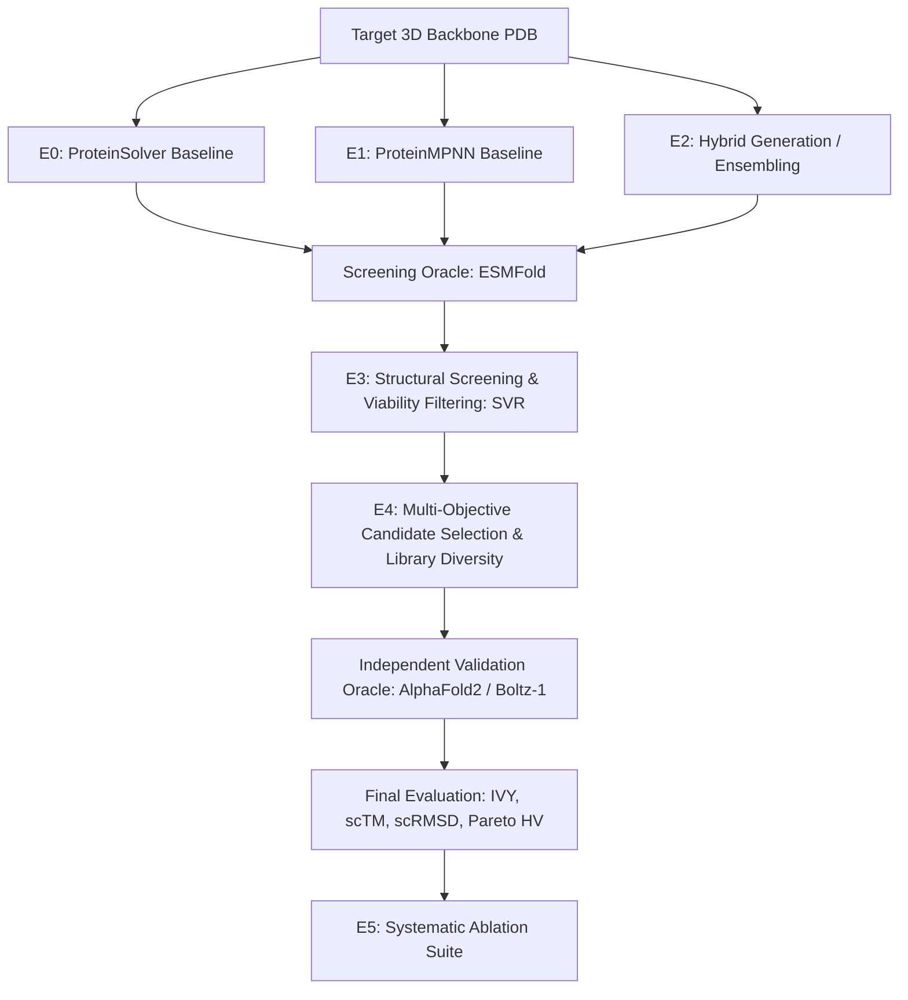

# EVALUATION PROTOCOL & EXPERIMENTAL SPECIFICATION (E0–E5)

This protocol specifies the controlled experimental matrix designed to empirically validate or falsify the project's primary research hypothesis:
> *"Does ProteinSolver's distance-graph constraint-satisfaction scoring provide orthogonal structural signal that improves modern inverse-folding candidate selection, or does modern inverse folding combined with structural validation dominate hybrid selection?"*

---

## 1. Experimental Matrix Overview

---

## 2. Experiment Specifications

### Experiment E0: Standalone ProteinSolver Baseline
- **Goal:** Establish reference performance of the original 4-block residual GNN using published weights from `ostrokach/proteinsolver`.
- **Inputs:** Target backbone heavy-atom distance matrix ($d_{ij} < 12\text{ \AA}$) and sequence separation $|i - j|$.
- **Sampling:** CSP-based sequential masked residue prediction at default temperature $T \in \{0.1, 0.5, 1.0\}$.
- **Outputs:** Candidate sequences $S_{\text{E0}}$ ($K = 100$ per target).
- **Metrics Computed:** Native Sequence Recovery (AAR), ProteinSolver Masked Perplexity (within-model diagnostic), scRMSD (C$\alpha$ Kabsch), scTM ($d_0(L_{\text{target}})$ normalized), pLDDT (ESMFold screening oracle), Generative Structural Viability Rate (SVR), Raw Sequence Diversity.
- **Evidentiary Scope Note:** Current verified E0 result on 1n5uA03 (41.30% recovery, 38/92 residues) is a single-target integration result; it is NOT a general benchmark and NOT proof of generalizability.

### Experiment E1: Modern Inverse-Folding Baselines
- **Goal:** Establish modern inverse-folding baselines using ProteinMPNN (Dauparas et al. 2022) (and optionally PiFold / ESM-IF1).
- **Inputs:** Full backbone atomic coordinates (N, CA, C, O).
- **Sampling:** Autoregressive sampling across temperature grid $T \in \{0.1, 0.2, 0.5, 0.8, 1.0\}$ with random residue decoding permutation orders.
- **Outputs:** Candidate sequences $S_{\text{E1}}$ ($K = 100$ per target).
- **Metrics Computed:** Same as E0. ProteinMPNN Autoregressive Perplexity is computed as a within-model diagnostic; it is NOT cross-model comparable to ProteinSolver masked pseudo-perplexity.

### Experiment E2: ProteinSolver + Modern Model Fusion (Hybrid Scoring)
- **Goal:** Test whether combining ProteinSolver and ProteinMPNN provides complementary signal.
- **Formulations Tested:**
  1. **Logit Interpolation:**
     $$z_{\text{hybrid}}(a_i) = \lambda \cdot z_{\text{MPNN}}(a_i) + (1 - \lambda) \cdot z_{\text{PS}}(a_i), \quad \lambda \in \{0.0, 0.2, 0.5, 0.8, 0.9, 1.0\}$$
  2. **Sequential Rescoring:** Generate candidates with ProteinMPNN ($T=0.5$), then rescore and rank via ProteinSolver log-likelihood.
  3. **Dual-Conditioned Masking:** Use ProteinSolver to identify high-confidence structural anchor positions, freeze them, and design remaining positions with ProteinMPNN.
- **Primary Milestone:** Determine if any hybrid configuration achieves higher recovery, higher structural viability, or lower scRMSD than pure ProteinMPNN ($\lambda = 1.0$).

### Experiment E3: Structural Screening & Viability Filtering
- **Goal:** Filter raw generated candidates through an initial structural screening oracle (ESMFold) to eliminate folding failures.
- **Protocol:**
  - Fold all raw candidates from E0, E1, and E2 using ESMFold locally.
  - Compute scRMSD against target backbone and mean pLDDT.
  - Apply project screening threshold: Viable candidates satisfy $\text{scRMSD} \le 2.0\text{ \AA}$ and $\text{pLDDT} \ge 80.0$. (Documented as a project screening threshold, not a universal canonical law).
  - Compute Generative Structural Viability Rate (SVR):
    $$\text{SVR} = \frac{|\{s \in S_{\text{raw}} \mid \text{scRMSD}(s) \le 2.0\text{ \AA} \land \text{pLDDT}(s) \ge 80.0\}|}{|S_{\text{raw}}|}$$
  - Compute Structurally Viable Sequence Diversity ($D_{\text{viable}}$).

### Experiment E4: Diversity-Aware Multi-Objective Candidate Selection & Independent Validation
- **Goal:** Select the optimal top-$M$ ($M = 10$ or $20$) candidate library from a candidate pool ($K = 500$) maximizing both quality and mutual diversity, followed by independent structural validation.
- **Selection Formulation:**
  - Multi-objective Pareto ranking across:
    1. Inverse-folding likelihood / confidence ($S_{\text{MPNN}}$ and/or $S_{\text{PS}}$)
    2. Structural self-consistency ($-\text{scRMSD}_{\text{screen}}$)
    3. Structural confidence ($\text{pLDDT}_{\text{screen}}$)
    4. Maximum-dispersion sequence diversity:
       $$\max_{S' \subset S_{\text{viable}}, |S'|=M} \sum_{u, v \in S'} \text{dist}(u, v) + \gamma \sum_{u \in S'} \text{Quality}(u)$$
- **Independent Validation Firewall:**
  - To prevent circular evaluation leakage, the final selected library $S_{\text{selected}}$ is validated using an **independent structural oracle** (AlphaFold2 or Boltz-1), distinct from the screening oracle (ESMFold).
- **Metrics Computed:**
  - Pareto Hypervolume (HV) computed with an a priori fixed reference point $\mathbf{r}$ (before inspecting candidates).
  - Selected Library Diversity ($D_{\text{selected}}$).
  - Independent Validation Yield (IVY):
    $$\text{IVY} = \frac{|\{s \in S_{\text{selected}} \mid \text{scRMSD}_{\text{val}}(s) \le 2.0\text{ \AA} \land \text{pLDDT}_{\text{val}}(s) \ge 80.0\}|}{|S_{\text{selected}}|}$$
    *(Non-tautological: evaluates post-selection candidates on a distinct validation oracle).*

### Experiment E5: Systematic Ablation Study
- **Goal:** Falsify alternative explanations and identify essential components.
- **Ablation Questions:**
  1. **Ablation 5.1 (No ProteinSolver):** Does ProteinMPNN alone + temperature sweep + diversity selection achieve identical Pareto hypervolume? If YES, ProteinSolver is redundant.
  2. **Ablation 5.2 (Naive Clustering vs. Pareto Selection):** Does simple CD-HIT clustering at 30% sequence identity match the Pareto selection framework?
  3. **Ablation 5.3 (Oracle Sensitivity):** Does replacing ESMFold with AlphaFold2 or Boltz-1 alter the ranking of candidates?

---

## 3. Benchmark Dataset Allocation (Planned Future Benchmarks)

*Note: All current results are single-target integration results on 1n5uA03. The allocations below represent the planned future multi-target evaluation protocol.*

| Benchmark Subset | Purpose | Number of Targets | Selection Criteria |
|---|---|---|---|
| **Development / Tuning Set** | Hyperparameter search ($\lambda, T, \gamma$) | 20 backbones | CATH 4.2 validation split; diverse folds ($\alpha, \beta, \alpha/\beta$). |
| **Primary Test Set** | Frozen evaluation of E0–E5 | 50 backbones | TS50 / CATH 4.2 test split with $<30\%$ identity to all training sets. |
| **De Novo Test Set** | Test on hallucinated backbones without natural homologs | 15 backbones | RFdiffusion generated scaffolds (Watson et al. 2023). |

---

## 4. Hardware & Runtime Budget

- **Local Machine Constraints:** Single GPU / CPU execution.
- **Candidate Pool Size:** $K = 100$ sequences per target for initial validation; $K = 500$ for final test benchmark.
- **Folding Oracle Strategy:** ESMFold locally (fast single-pass transformer) for primary screening; validate top selected candidates ($M = 10–20$) with independent AlphaFold2 / ColabFold / Boltz-1.
- **Benchmark Latency Protocol:** All models benchmarked on identical hardware, recording device, precision, batch size, warm-up iterations, and excluding model loading overhead.

